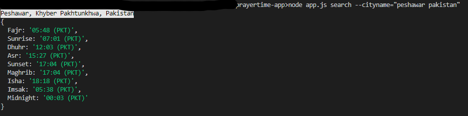

# Prayer Times نماز کے اوقات

## Prayer Times نماز کے اوقات
Prayer Times  نماز کے اوقات is a backend nodeJS application that searches any input location, retrieves the longitude and latitude using MAPBOX API, and then fetches the Prayer Times information from the Aladhan API. Currently It does not have front end , front will be added in next release.

## Technologies Used
- NodeJS: the app has its own server, built using Express
- Mapbox API: the app uses the third party API Mapbox Geolocating
- ALAdhan API: the app uses the third party API powered by ALAdhan API to retreive Prayers Times information

## Installation Instructions

1. Run `npm install` in the root folder and the client folder (each app has its own package.json and dependencies that need to be installed).
4. To launch the app locally go to the app directory run `node app.js --search --cityname="anycityname"`.

## Unsolved Problems/Next Steps
- Automatic geo-location
- Front-end
